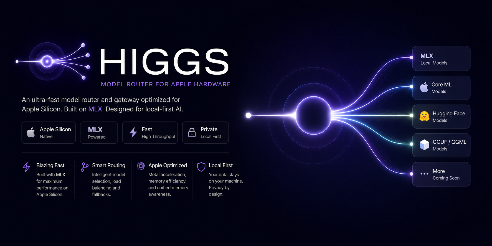
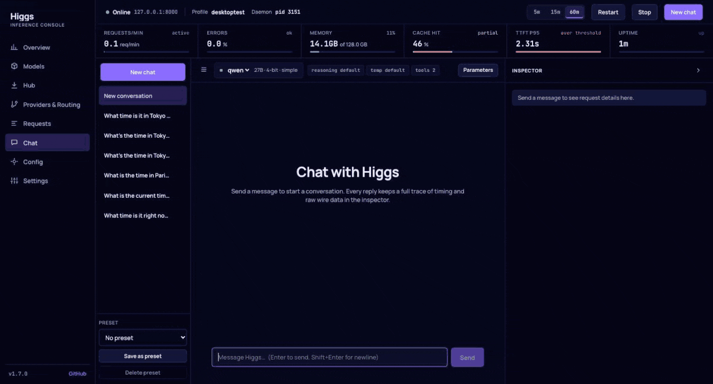

<div align="center">



**Local LLM inference server for Apple Silicon, with a router, an OpenAI and Anthropic compatible API, and a desktop console that shows how fast each local request ran.**

[](https://github.com/panbanda/higgs/actions/workflows/ci.yml)
[](https://github.com/panbanda/higgs/releases)
[](https://crates.io/crates/higgs)
[](#license)
[](#install)



</div>

Higgs is a Rust binary (plus its Metal shader library) built on [MLX](https://github.com/ml-explore/mlx). It serves open-weight models from Hugging Face on your Mac, proxies to OpenAI, Anthropic, Ollama and other providers behind the same endpoint, and translates between the OpenAI and Anthropic wire formats so existing tools keep working. The desktop app is the graphical counterpart of `higgs attach`: a dashboard of the server and its models, and a chat whose inspector traces every span of a request.

## Why Higgs

- **Fast on Apple Silicon.** Native MLX inference with prefix caching, continuous batching for transformer families, quantized KV cache, and MoE prefill tuning. See [Performance](#performance).
- **One endpoint for everything.** Local models and remote providers behind one URL, with regex routes, aliases, and an optional auto-router that picks a model per prompt.
- **Drop-in for your tools.** `higgs shellenv` exports `OPENAI_BASE_URL` and `ANTHROPIC_BASE_URL`; Claude Code, Aider, and any OpenAI or Anthropic client just work.
- **You can see what is happening.** Time to first token, decode tokens per second, and prefix-cache hits for local streaming requests, plus latency, throughput, and memory, in the `/metrics` API and the desktop app.

## Install

```bash
brew install panbanda/brews/higgs
brew install --cask panbanda/brews/higgs-desktop # desktop app; bundles the CLI
```

Or grab the binary and the desktop app from the [latest release](https://github.com/panbanda/higgs/releases/latest), or build from source with Rust 1.88+ and the Xcode Command Line Tools:

```bash
cargo build --release
```

## Quick start

Serve a model from Hugging Face (downloaded on first use):

```bash
higgs serve --model mlx-community/Qwen3.6-35B-A3B-4bit
```

Talk to it with any OpenAI client:

```bash
curl http://localhost:8000/v1/chat/completions \
  -H "Content-Type: application/json" \
  -d '{"model":"mlx-community/Qwen3.6-35B-A3B-4bit","messages":[{"role":"user","content":"Write one sentence about Cape Town."}]}'
```

Point your tools at it:

```bash
eval "$(higgs shellenv)"      # exports OPENAI_BASE_URL and ANTHROPIC_BASE_URL
higgs exec -- claude          # or aider, or anything OpenAI/Anthropic compatible
```

For a persistent setup with several models, providers, and routes, create a config and run the daemon:

```bash
higgs init                    # writes ~/.config/higgs/config.toml
higgs doctor                  # validates models, providers, and settings
higgs start                   # background daemon with metrics
higgs attach                  # terminal dashboard
```

## Desktop app


Ships with every release as a `.dmg` for Apple Silicon (unsigned; right-click, Open on first launch). It runs on the machine that runs Higgs and reads the same config, metrics log, and pid files as the CLI.

- **Signal strip and Overview.** Requests per minute, error rate, MLX memory, prefix-cache hit rate, TTFT p95 against a threshold, decode tokens per second, latency percentiles, and a live log.
- **Models, Requests, Providers & Routing.** Everything `higgs attach` shows, with TTFT, decode rate, and cache hits per model and per request, and a Hub for browsing and downloading `mlx-community` checkpoints.
- **Chat with a request trace.** Every reply keeps a trace: a waterfall of prefill (with cache hits), thinking, generation, tool calls, and stalls across rounds; throughput; tokens; the exact request with Replay and Copy as curl; raw SSE chunks; and a Copy as Markdown report for sharing speed numbers.
- **Config editor.** Form or raw TOML, validated on save, followed by `higgs doctor`, with daemon Start, Stop, and Restart.


Details, data sources, and browser-mode development: [docs/desktop.md](docs/desktop.md).

## Supported models

MLX checkpoints from Hugging Face IDs or local paths: Qwen 3.x (dense and MoE, including 3.5, 3.6, and 3.8), Llama, Mistral, Gemma 2, 3, and 4, Phi-3, Starcoder2, DeepSeek-V2, and LLaVA-Qwen2 vision models. Unknown newer versions of a supported family load with the nearest adapter and a warning; unknown families are rejected with the supported list. The full matrix is in [docs/models.md](docs/models.md).

## Configuration

```toml
[server]
host = "127.0.0.1"
port = 8000

[[models]]
path = "mlx-community/Qwen3.6-35B-A3B-4bit"
name = "qwen"

[provider.anthropic]
url = "https://api.anthropic.com"
format = "anthropic"

[[routes]]
pattern = "claude-.*"
provider = "anthropic"

[default]
provider = "higgs"
```

Requests for `qwen` run locally; anything matching `claude-.*` is proxied to Anthropic with format translation; everything else falls through to the default. Routing precedence, the auto-router, KV cache and prefill options, profiles, and metrics settings are covered in [docs/configuration.md](docs/configuration.md).

## API and CLI Overview

**API endpoints**

- OpenAI: `/v1/chat/completions`, `/v1/completions`, `/v1/embeddings`, `/v1/models`
  - Streaming requests may set `"return_progress": true` to receive
    llama.cpp-compatible `prompt_progress` chunks (`{total, cache, processed,
    time_ms}`) during chunked prefill.
- Anthropic: `/v1/messages`, `/v1/messages/count_tokens`
- Metrics: `/metrics` (window totals, latency and time-to-first-token
  percentiles, aggregate tokens/s, per-model and per-provider groups with
  TTFT, tokens/s, and prefix-cache hits). Local streaming requests record
  `ttft_ms` and `cached_tokens` in the metrics JSONL log.
- System: `/v1/system` (version, pid, uptime, unified memory, process RSS,
  MLX active/peak/cache memory, loaded models with engine kind and profile)
- Health: `/health`

`/health`, `/metrics`, `/v1/models`, and `/v1/system` are dashboard endpoints and
never count as traffic in metrics.

**Core commands**

- `higgs serve`: start in the foreground
- `higgs start`: start a background daemon from config or profile
- `higgs stop`: stop a running daemon, or use `higgs stop --force`
- `higgs attach`: open the daemon metrics dashboard
- `higgs init`: create `~/.config/higgs/config.toml`
- `higgs doctor`: validate config, model paths, and providers
- `higgs shellenv`: print `ANTHROPIC_BASE_URL` and `OPENAI_BASE_URL` after verifying the server is reachable
- `higgs exec -- <cmd>`: run a tool with those variables set after the same reachability check


## Apple Silicon Notes

- Release artifacts bundle `mlx.metallib`.
- Source builds also require `mlx.metallib` next to the executable. Higgs now restores it automatically from Cargo build output when possible, then fails loudly if it still cannot be found.
- `[local].raise_wired_limit` defaults to `false`. Enable it only when you explicitly want MLX to raise the process wired-memory limit.
- `batch=true` is only supported for transformer families with true batched decode support.
- For batch models, `prefill_yield_tokens` can interleave long prompt prefills with decode; use `0` or omit it for the synchronous default.


## Performance

Benchmarks below were run on M4 Max 128GB. Methodology, harness details, and benchmark-driven defaults are documented in [docs/benchmarking.md](docs/benchmarking.md).

### Decode Throughput (tok/s)

Single request, 500 generated tokens, median of 3 runs.

| Model | higgs | mlx_lm | vllm-mlx | llama.cpp | Ollama |
|---|---|---|---|---|---|
| Llama-3.2-1B-4bit | 448 | 421 | 433 | 314 | 305 |
| Mistral-7B-v0.3-4bit | 103 | 103 | -- | 87 | 85 |
| Qwen3-1.7B-4bit | 305 | 293 | 300 | 216 | 183 |
| Qwen3-30B-A3B-8bit | 75 | 86 | 87 | 83 | 73 |
| Gemma-2-2B-4bit | 163 | 185 | 91 | -- | -- |
| Phi-3-mini-4bit | 171 | 170 | 95 | -- | -- |
| Starcoder2-3B-4bit | 107 | 176 | 165 | -- | -- |
| DeepSeek-V2-Lite-4bit | 140 | 174 | 99 | -- | -- |

MLX models use 4-bit, or 8-bit for MoE. `llama.cpp` and Ollama use `Q4_K_M`, or `Q8_0` for MoE.

### MoE Prefill (time to first token)

Measured on DeepSeek-V2-Lite-4bit with global batch sorting before `gather_qmm`.

| Prompt tokens | Before | After | Speedup |
|---|---|---|---|
| 59 | 472ms | 227ms | 2.1x |
| 481 | 3,734ms | 863ms | 4.3x |
| 1,831 | 14,390ms | 3,123ms | 4.6x |
| 4,532 | 37,489ms | 8,860ms | 4.2x |

### Continuous Batching (Llama-1B)

| Concurrent requests | higgs tok/s | vllm-mlx tok/s |
|---|---|---|
| 1 | 280 | 250 |
| 2 | 585 | 459 |
| 4 | 698 | 510 |
| 8 | 755 | 646 |

### Memory (RSS in MB)

| Model | higgs | mlx_lm | vllm-mlx |
|---|---|---|---|
| Llama-3.2-1B-4bit | 974 | 1,356 | 1,380 |
| Mistral-7B-v0.3-4bit | 3,965 | 4,384 | -- |
| Qwen3-1.7B-4bit | 1,127 | 1,609 | 1,641 |
| Qwen3-30B-A3B-8bit | 31,139 | 31,640 | 31,658 |
| Gemma-2-2B-4bit | 1,645 | 2,329 | 2,350 |
| Phi-3-mini-4bit | 2,126 | 2,548 | 2,573 |
| DeepSeek-V2-Lite-4bit | 8,528 | 8,972 | 8,998 |

### Feature Comparison

| | higgs | vllm-mlx |
|---|---|---|
| Structured output (10 prompts, JSON schema) | 100% | 0% |
| Reasoning extraction (5 questions, Qwen3) | 5/5 | 4/5 |
| All architectures produce coherent output | Yes | Yes |


## Development

```bash
cargo test -- --test-threads=1
cargo clippy
cargo fmt --check
cd apps/desktop && pnpm install && pnpm typecheck && pnpm build
```

Contributor workflow, project structure, release validation, and doc expectations live in [CONTRIBUTING.md](CONTRIBUTING.md). Migration notes for older `higgs start` flags are in [docs/configuration.md](docs/configuration.md).

## License

MIT
