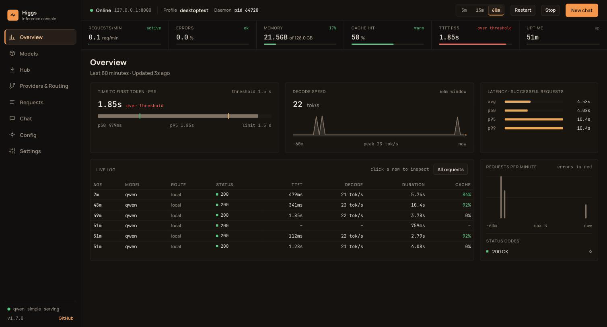
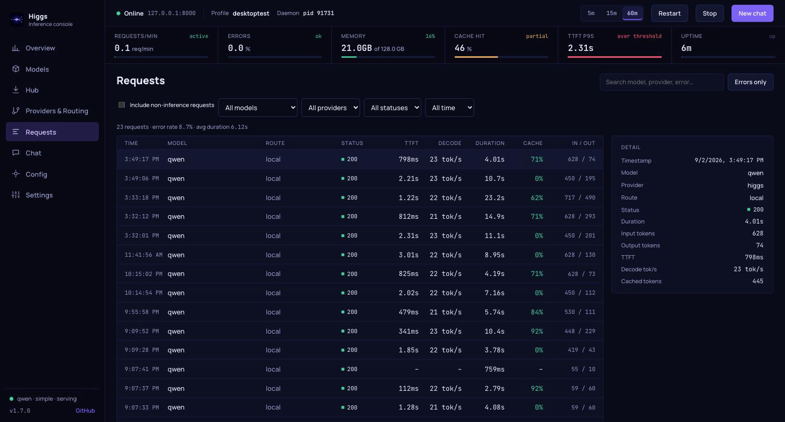
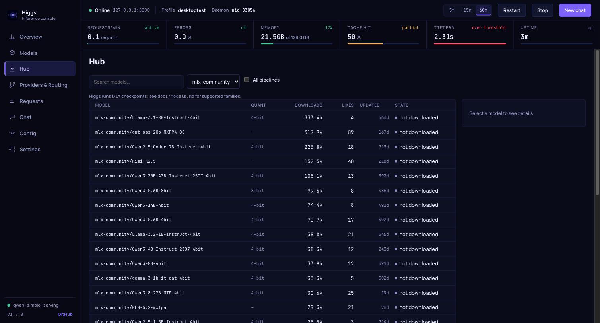
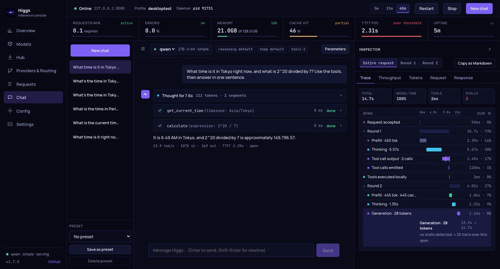

# Higgs Desktop

A native macOS dashboard for a running Higgs server: the graphical counterpart
of `higgs attach`, with a chat that doubles as a request profiler.



## Install

```bash
brew install --cask panbanda/brews/higgs-desktop
```

Once installed, `higgs ui` launches it from the terminal.

The app bundles its own copy of the `higgs` CLI, so no separate CLI install is
needed. A `higgs` already on `PATH` (for example from `brew install higgs`)
takes precedence over the bundled copy.

Or grab `Higgs_<version>_aarch64.dmg` or the zipped `Higgs.app` directly from a
GitHub release. Either way the bundle is not notarized, so the first launch
needs a right-click, Open, or:

```bash
xattr -dr com.apple.quarantine /Applications/Higgs.app
```

Or run from source:

```bash
cd apps/desktop
pnpm install
pnpm tauri dev
```

The app reads the same files the CLI uses: `~/.config/higgs/config[.profile].toml`,
`logs/metrics[.profile].jsonl`, and `higgs[.profile].pid`, so it expects to run on
the machine that runs Higgs. Set the profile, server URL, and `higgs` binary path
in Settings. The API key and the Hugging Face token are stored in the macOS
Keychain (native app) or held only for the session (browser mode); leave them
empty unless the server or a gated repo needs them.

## Metrics need config mode

Higgs only records metrics when started from a config file: `higgs start`,
`higgs start --profile <name>`, or `higgs serve --config <file>`. A plain
`higgs serve --model ...` serves the API but writes no metrics, so the dashboard
shows health and chat only. The Overview says so when the log is missing.

## Sections

**Signal strip.** Under the header on every section: requests per minute, error
rate, MLX memory of physical, prefix-cache hit rate, TTFT p95, and uptime, each
colored by threshold. The 5m / 15m / 60m control in the header sets the window
for everything on the page.

**Overview.** TTFT p95 against its threshold, decode tokens per second with a
sparkline, latency percentiles, requests per minute with errors, status codes,
and a live log. Click a log row to open it in Requests.



**Hub.** Browse `mlx-community` (or any author) on Hugging Face, filtered to
text-generation checkpoints, with downloads, likes, quantization, and whether the
repo is already in the local cache. Selecting a model shows its size, file count,
and `model_type`; Download writes it into the standard Hugging Face cache layout
so `higgs` resolves it like any other checkpoint, then "Add to config" appends a
`[[models]]` entry. Gated repos need a Hugging Face token, set in Settings.



**Models.** Configured models joined with what the server is serving: state,
engine kind, size on disk, requests, TTFT, and decode rate. Chat opens a
conversation with that model.

**Requests.** Every logged request with TTFT, decode rate, duration, cache hit,
and token counts; filters by model, provider, status class, time, and text; a
detail panel with the full record including error bodies.

**Providers and Routing.** Providers with traffic, routes, the default route,
and the auto router.

**Chat.** Streams `/v1/chat/completions` with a thinking block, tool-call rows
(two built-in tools run locally and their results are fed back to the model),
presets, and per-turn parameters.



**Inspector.** Every reply keeps a trace. The Trace tab is a waterfall of the
whole call: request accepted, per-round prefill (with cache hits), thinking,
generation, tool execution, stream closed, on a time axis with duration and
share per span and stalls over one second marked. The scope switch narrows the
axis to one round. Throughput, Tokens, Request (with Replay and Copy as curl),
and Response (every SSE chunk) cover the rest. "Copy as Markdown" produces a
fixed-format report of the run for sharing speed numbers.

**Config.** Form and raw TOML editors for the active config or profile, saved
with validation, followed by `higgs doctor` output; Start, Stop, Restart, and
Apply and restart for the daemon; the daemon log tail.

## Where the numbers come from

| Number | Source |
|---|---|
| Duration, tokens, status, route | metrics JSONL log written by the daemon |
| TTFT, cached tokens | same log; recorded for local streaming requests |
| Decode tok/s | completion tokens over time after the first token |
| Cache hit % | cached prompt tokens over prompt tokens in the window |
| Memory, uptime, loaded models | `GET /v1/system` |
| Inspector trace | SSE chunk arrival times observed by the app |

Dashboard polling of `/health`, `/metrics`, `/v1/models`, and `/v1/system` never
counts as traffic.

## Browser mode for development

`pnpm dev` serves the UI at http://localhost:1420. A dev-only Vite middleware
provides the same local commands as the native app (config, log, daemon, CLI),
and the server needs CORS: `HIGGS_CORS_ORIGINS='["*"]' higgs serve --profile ...`
or `server.cors_origins` in the config.

## Release builds

The release workflow builds the app on every tagged release and attaches the
`.dmg`, the zipped `.app`, and a checksum file. `pnpm tauri build` produces the
same bundles locally under `apps/desktop/src-tauri/target/release/bundle/`.
